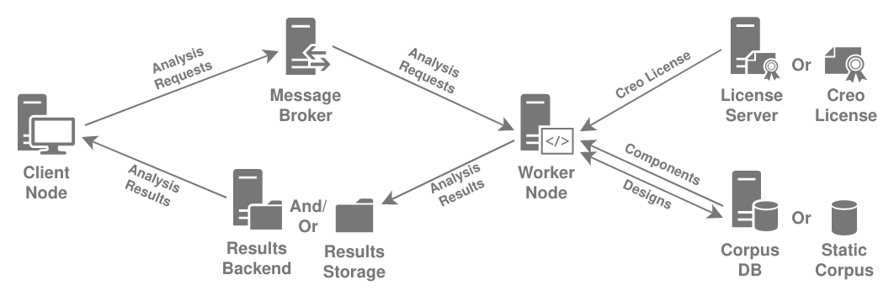

--8<-- "README.md"

**And [the Github Repo](https://github.com/LOGiCS-Project/swri-simple-uam-pipeline/) for the source code, issues, etc...**

## Organization

<figure markdown>
  
  <figcaption>SimpleUAM Component Structure</figcaption>
</figure>

SimpleUAM organizes itself into components, each of which perform
some basic task needed to evaluate UAV or UAM designs:

  - **Client Nodes**: Makes requests for UAV/UAM design analysis.
  - **Message Broker**: Distributes analysis requests from clients to available
    workers.
  - **Worker Nodes**: Analyzes designs with SWRi's pipelines, placing the results
    into storage.
  - **Engineering Corpus**: Provides component and design data to the
    worker nodes during analysis.
  - **License Servers**: Provides floating Creo licenses to workers.
  - **Results Storage**: Store the results of design analyses on the file system,
    whether it's in a local folder or a network drive.

These components aren't tied to specific machines and can all happily coexist on
a single computer or support multiple servers cooperating on each task.

This project provides support for versions of all of these nodes including
setup scripts and python libraries for interacting with them.

## Links

 - [**Install Instructions**](setup/intro.md)
 - [**Configuration Instructions**](usage/config.md)

## Repo Organization

```
<repo-root>
├── LICENSE           # License File
├── README.md         # Readme File
├── pyproject.toml    # Project Setup Info. For use with pdm, poetry, or similar.
├── mkdocs.yml        # Documentation Configuration via mkdocs
│
├── config/   # Config files for type checking, linting, etc...
├── docs/     # Source for gh-pages documentation.
└── src/    # Python source root
```
