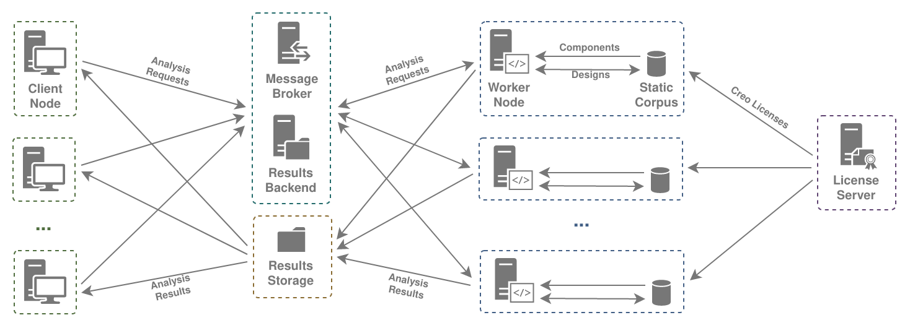

# SimpleUAM Installation Guide

!!! info

    We would appreciate assistance in making this guide better.
    Any notes on issues with the install process, lack of clarity in wording,
    or other improvements would be appreciated.

<figure markdown>
  
  <figcaption>SimpleUAM Component Structure</figcaption>
</figure>

The core goal of SimpleUAM is allow users to set up a service for processing
requests to analyze UAM and UAV designs.
Client nodes, such as optimizers or search tools, should be able to queue
requests for distribution to worker nodes as they become available.
The results of those analyses, packaged as zip files, should then be made
available to the clients as they're completed.

In order to form a complete SimpleUAM service some core requirements need to be met:

- There needs to be a configured, running worker node to run analyses.
- Each worker node needs to have a Creo license, either through a node-locked
  license or a connection to a Creo license server.
- Each worker node needs to have access to an engineering corpus, either through
  a graph database holding all the data or through a static corpus file which
  has the same information.
- Each worker has to have access to results storage, a folder
  on the local file system or a network drive, where zip files with results
  from each analysis will be placed.
- There must be a message broker which workers can connect to in order to
  retrieve open analysis requests.
- Client nodes should be able to access the results store to get the
  archives with the analysis results.

With those requirements met, a client node can then send requests to the message
broker and watch the results store for their completed analyses.

## Choosing a Service Topology

It's possible to distribute SimpleUAM components between multiple machines
in numerous ways that meet the given requirements.
Picking a topology, specifically the components that go on each individual
machine, tells you which installation steps are needed for that machine.

We'll look at two example topologies, one I use for (semi)local development
work and one for a potential production system.

<figure markdown>
  
  <figcaption>Development SimpleUAM System</figcaption>
</figure>

This development setup has a local machine and a single worker.
The local machine is set up so it can run a SimpleUAM client and so that any
code shared with a worker node can be edited in whatever manner the user is
comfortable with.
The worker node then has all the other necessary components of the service,
including broker, license, and corpus.

The structure is a broad guideline and can be tweaked as needed.
For instance, if you're running windows you can just run all the components on
your local machine and use a stub message broker that will run analysis requests
as blocking calls.

<figure markdown>
  
  <figcaption>Production SimpleUAM System</figcaption>
</figure>

The production service has significantly more going on.
There are one or more clients producing analysis requests, multiple workers
processing them, a Creo license server, a message broker, and a results
server.

Other topologies are also viable, for instance running a central graph database
for all the workers to share instead of relying on a local, static corpus.

The important part is knowing what components you want on each machine.

## Command Line Interfaces

All the command line scripts SimpleUAM provides are made using
[Invoke](https://www.pyinvoke.org/) and evaluated within a
[PDM](https://pdm.fming.dev/latest/) administered python environment.

This means that all the SimpleUAM provided commands must be run from
`<repo-root>` and have this format:

```bash
pdm run <command>
```

All the core SimpleUAM commands `suam-config`, `setup-win`, `craidl`,
`d2c-workspace`, and `d2c-client` will print a help message when run without
arguments.
In their base form these commands are safe and will never make change to your
system.
The help messages also provide a list of subcommands that do perform
various tasks.

These subcommands are run with:

```bash
pdm run <command> <sub-command> [ARGS]
```

All of these subcommands come with detailed help information that can be
accessed with:

```bash
pdm run <command> <sub-command> --help
```

These help messages are worth checking for available options and notes.

## Configuration

SimpleUAM uses an internal configuration system based on
[OmegaConf](omegaconf.readthedocs.io/).
It reads YAML files in a platform specific directory for settings that are
used throughout the system.
While you can find a more detailed breakdown of the system [here](../usage/config.md)
here is a quick overview.

Once the SimpleUAM project is installed (in [General Setup](general.md)) you
can run the following command to find the config file directory:

```bash
pdm run suam-config dir
```

Files placed there will be loaded when most SimpleUAM code is started up.
The configuration is immutable for the runtime of a program and changes will
require a restart to register.

You can get a printout of the current configuration state with the following:

```bash
pdm run suam-config print --all
```

??? example "Sample Output of `pdm run suam-config print --all`"

    ```yaml
    ### paths.conf.yaml ###

    config_directory: /etc/xdg/xdg-budgie-desktop/SimpleUAM/config
    cache_directory: /usr/share/budgie-desktop/SimpleUAM/cache
    log_directory: /home/rkr/.cache/SimpleUAM/log
    work_directory: /usr/share/budgie-desktop/SimpleUAM
    data_directory: /usr/share/budgie-desktop/SimpleUAM/data

    ### win_setup.conf.yaml ###

    global_dep_packages:
    - checksum
    - wget
    - 7zip
    broker_dep_packages:
    - rabbitmq
    worker_dep_packages:
    - rsync
    worker_pip_packages:
    - psutil
    - numpy
    license_dep_packages: []
    graph_dep_packages:
    - openjdk11
    qol_packages:
    - firefox
    - notepadplusplus
    - foxitreader
    - tess
    - freecad

    ### craidl.conf.yaml ###

    example_dir: ${path:data_directory}/craidl_examples
    stub_server:
      cache_dir: ${path:cache_directory}/corpus_stub_cache
      server_dir: ${path:data_directory}/corpus_stub_server
      graphml_corpus: ${path:data_directory}/corpus_stub.graphml
      host: localhost
      port: 8182
      read_only: false
    server_host: ${stub_server.host}
    server_port: ${stub_server.port}
    static_corpus: ${path:data_directory}/corpus_static_dump.json
    static_corpus_cache: ${path:cache_directory}/static_corpus_cache
    use_static_corpus: true

    ### d2c_workspace.conf.yaml ###

    workspace_subdir_pattern: workspace_{}
    reference_subdir: reference_workspace
    assets_subdir: assets
    locks_subdir: workspace_locks
    records_dir: ${workspaces_dir}/records
    records:
      max_count: -1
      min_staletime: 3600
      metadata_file: metadata.json
      log_file: log.json
    max_workspaces: 4
    workspaces_dir: ${path:work_directory}/d2c_workspaces
    cache_dir: ${path:cache_directory}/d2c_workspaces
    exclude:
    - .git
    exclude_from: []
    record_exclude:
    - .git
    record_exclude_from: []

    ### d2c_worker.conf.yaml ###

    broker:
      protocol: amqp
      host: 127.0.0.1
      port: 5672
      db: ''
      url: ${.protocol}://${.host}:${.port}${.db}
    backend:
      enabled: false
      protocol: redis
      host: 127.0.0.1
      port: 6379
      db: '0'
      url: ${.protocol}://${.host}:${.port}/${.db}
    max_processes: ${d2c_workspace:max_workspaces}
    max_threads: 1
    shutdown_timeout: 600000
    skip_logging: false
    ```

If you want to see the full expanded version of the configs, with
all the [interpolations](https://omegaconf.readthedocs.io/en/2.1_branch/usage.html#variable-interpolation)
resolved, add the `--resolved` flag.

??? example "Sample Output of `pdm run suam-config print --all --resolved`"

    ```yaml
    ### paths.conf.yaml ###

    config_directory: /etc/xdg/xdg-budgie-desktop/SimpleUAM/config
    cache_directory: /usr/share/budgie-desktop/SimpleUAM/cache
    log_directory: /home/rkr/.cache/SimpleUAM/log
    work_directory: /usr/share/budgie-desktop/SimpleUAM
    data_directory: /usr/share/budgie-desktop/SimpleUAM/data

    ### win_setup.conf.yaml ###

    global_dep_packages:
    - checksum
    - wget
    - 7zip
    broker_dep_packages:
    - rabbitmq
    worker_dep_packages:
    - rsync
    worker_pip_packages:
    - psutil
    - numpy
    license_dep_packages: []
    graph_dep_packages:
    - openjdk11
    qol_packages:
    - firefox
    - notepadplusplus
    - foxitreader
    - tess
    - freecad

    ### craidl.conf.yaml ###

    example_dir: /usr/share/budgie-desktop/SimpleUAM/data/craidl_examples
    stub_server:
      cache_dir: /usr/share/budgie-desktop/SimpleUAM/cache/corpus_stub_cache
      server_dir: /usr/share/budgie-desktop/SimpleUAM/data/corpus_stub_server
      graphml_corpus: /usr/share/budgie-desktop/SimpleUAM/data/corpus_stub.graphml
      host: localhost
      port: 8182
      read_only: false
    server_host: localhost
    server_port: 8182
    static_corpus: /usr/share/budgie-desktop/SimpleUAM/data/corpus_static_dump.json
    static_corpus_cache: /usr/share/budgie-desktop/SimpleUAM/cache/static_corpus_cache
    use_static_corpus: true

    ### d2c_workspace.conf.yaml ###

    workspace_subdir_pattern: workspace_{}
    reference_subdir: reference_workspace
    assets_subdir: assets
    locks_subdir: workspace_locks
    records_dir: /usr/share/budgie-desktop/SimpleUAM/d2c_workspaces/records
    records:
      max_count: -1
      min_staletime: 3600
      metadata_file: metadata.json
      log_file: log.json
    max_workspaces: 4
    workspaces_dir: /usr/share/budgie-desktop/SimpleUAM/d2c_workspaces
    cache_dir: /usr/share/budgie-desktop/SimpleUAM/cache/d2c_workspaces
    exclude:
    - .git
    exclude_from: []
    record_exclude:
    - .git
    record_exclude_from: []

    ### d2c_worker.conf.yaml ###

    broker:
      protocol: amqp
      host: 127.0.0.1
      port: 5672
      db: ''
      url: amqp://127.0.0.1:5672
    backend:
      enabled: false
      protocol: redis
      host: 127.0.0.1
      port: 6379
      db: '0'
      url: redis://127.0.0.1:6379/0
    max_processes: 4
    max_threads: 1
    shutdown_timeout: 600000
    skip_logging: false
    ```

You can also use the `write` subcommand to write sample config files out to
the appropriate locations. Run the following for more info:

```bash
pdm run suam-config write --help
```

**Further details are [here](../usage/config.md)...**

## Placeholder Conventions

Throughout these install instructions, but especially in the AWS setup,
we use placeholders like `<this-one>` to represent user provided information
or things that might be needed later.
This guide tries to proactive about asking you to save potentially useful
information.
We recommend keeping a file open for this.

??? example "Placeholder file from partway through AWS setup."

    ```yaml
    aws-vpc: suam-project1
    aws-vpc-id: vpc-0c2ca2caaf403057f
    aws-elastic-ip: 44.206.27.84
    aws-public-subnet: subnet-0cfe362170f73830d
    aws-private-subnet: subnet-0a94695b5b8b8c9c2
    aws-default-sg: sg-03e11656feb78ca14
    aws-cert-id: 856062a4-b146-4c58-893c-72205a6c47ee
    aws-cert-arn: arn:aws:acm:us-east-1:689242578769:certificate/856062a4-b146-4c58-893c-72205a6c47ee
    ```

We never use this information programmatically, so use whatever format you want,
but it does make it easier to keep track of what you're doing during install.
This is particularly important if you are setting up multiple machines and
don't want to waste time.

## AWS Network Setup

If you are using AWS you can start with our instructions for setting up a
virtual private cloud (VPC).
It sets up a private subnet for non-client machines and a VPN and Network drive
for access to that private subnet.

- **[AWS (Network) Setup](aws-network.md)**

## Machine Setup

Installation for each machine requires following the other pages in this section
in order, skipping any that aren't relevant and always including general setup.
Try to setup machines with centralized functions, like the license server and
message broker, before the worker nodes.

- **[AWS (Instance) Setup](aws-instance.md)**
- **[General Setup](general.md)** *(Required)*
- **[Creo License Server](license_server.md)**
- **[Message Broker](broker.md)**
- **[Engineering Corpus](corpus.md)**
- **[Worker Node](worker.md)**
