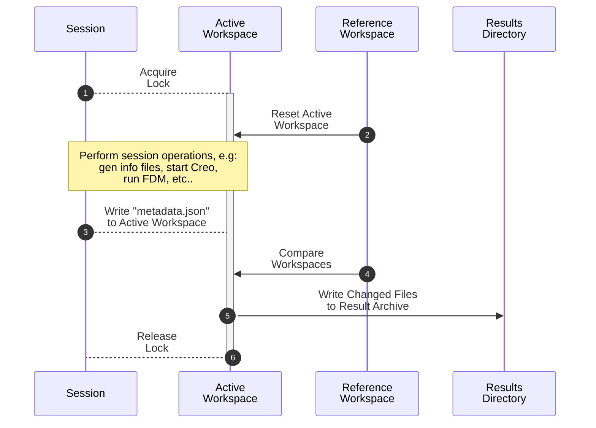

# Direct2Cad Workspace

A workspace is an isolated environment for SWRi's direct2cad scripts to run in.
Various tasks will run in a workspace and have their results bundled into a
zip file for use by clients.

## Basic Workspace Operation {#operation}

In order to describe how operations occur in a workspace we need to define a
few concepts:

- **Workspace**: An isolated environment, in practice a file
  folder, in which direct2cad operations are run.
- **Session**: A set of operations, python and console commands, that are run
  within a workspace to do something, usually processing a design with
  direct2cad.
- **Reference Workspace**: This is a static, read-only workspace which is used
  to initialize a session.
- **Active Workspace**: The workspace that is currently running a session.
- **Result Archive**: A zip file that contains all the output from a session.

The flow is as follows:



1. **Acquire Lock**: Each active workspace has a lock that prevents multiple
   processes and threads from using it at simultaneously.
   The session acquires the lock for the first available workspace or
   fails with an error if none are available.
2. **Reset Workspace**: We use `rsync` to make sure the active workspace is a
   perfect copy of the reference workspace for the various session operations.
3. **Write `metadata.json`**: The `metadata.json` file will end up in the
   result archive, with information about the worker node, the specific workspace
   being used, and whatever metadata the session was given when it was
   initialized.
4. **Compare Workspaces**: Use `rsync` to get a list of files that have changed
   relative to the reference workspace.
5. **Write Results**: Make zip archive with all the changes and place it in the
   results directory.
6. **Release Lock**: Allow other sessions or processes to use the workspace
   again.

## The Reference Workspace {#reference}

Run the following to initialize or update the reference workspace:

```bash
pdm run d2c-workspace setup.reference-workspace
```

This shouldn't be run when there are any ongoing sessions.

## Provided Sessions {#sessions}

There are three basic sessions provided with SimpleUAM, though more can be
added by modifying [`simple_uam.direct2cad.D2CSession`](../../reference/simple_uam/direct2cad/session/#simple_uam.direct2cad.session.D2CSession).

### Start Creo {#session-creo}

Starts Creo and the creoson server on the worker.
This is mostly useful for testing, the other sessions that need to start Creo
will do it automatically.
Run with the following:

```bash
pdm run d2c-workspace tasks.start-creo
```

A mostly empty result archive will be written to the results directory when
the session is finished.

Arguments:

- **`--output=FILE`**: Write the output metadata to `FILE`.
  Metadata will be printed to console if not provided.
- **`--workspace=NUM`**: Use workspace `NUM` if available.
  The first available workspace will be used if not provided.

### Generate Info Files {#session-gen-info}

Uses the craidl code to generate info files for a design albeit within a
session that writes the results to an archive in the results directory.
With a `design_swri.json` at `<design-loc>`, run with:


```bash
pdm run d2c-workspace tasks.gen-info-files --input=<design-loc>
```

The output result archive will contain:

- **`metadata.json`**: Assorted metadata from this session.
- **`design_swri.json`**: The design file.
- **`info_*.json`**: Input files generated by craidl.

Arguments:

- **`--output=FILE`**: Write the output metadata to `FILE`.
  Metadata will be printed to console if not provided.
- **`--workspace=NUM`**: Use workspace `NUM` if available.
  The first available workspace will be used if not provided.

### Process Design {#session-process-design}

This processes an input design with the direct2cad pipeline.
With a `design_swri.json` at `<design-loc>`, run with:


```bash
pdm run d2c-workspace tasks.gen-info-files --input=<design-loc>
```

The output result archive will contain:

- The additional files from `gen-info-files`.
- Various CAD files and outputs from the direct2cad pipeline.
- **`buildcad.stdout`**: The output stream from `buildCad.py`.
- **`buildcad.stderr`**: The error stream from `buildCad.py`.

Arguments:

- **`--output=FILE`**: Write the output metadata to `FILE`.
  Metadata will be printed to console if not provided.
- **`--workspace=NUM`**: Use workspace `NUM` if available.
  The first available workspace will be used if not provided.

## Workspace Management {#manage}

Get the cache directory for these workspaces:

```bash
pdm run d2c-workspace manage.cache-dir
```

Get the root directory of the reference workspace and the live workspaces:

```bash
pdm run d2c-workspace manage.workspaces-dir
```

Get the records directory for these workspaces.
This is where the zip files with
data from each session will go.
Run with:

```bash
pdm run d2c-workspace manage.records-dir
```

Prune the records directory by deleting old records until only the configured
maximum are present.
It will not delete records that are newer than the
configured `min_staletime`.
Run with:

```bash
pdm run d2c-workspace manage.prune-records
```

Delete any file system locks that might have gotten left behind. These
usually prevent multiple processes from taking control of the same live
workspace.
Run with:

```bash
pdm run d2c-workspace manage.delete-locks`
```
